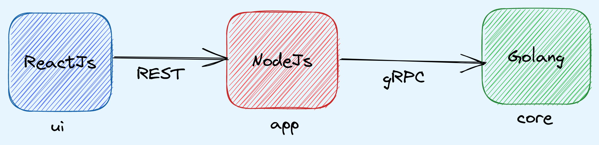

# Contribution Guidelines
Please read this guide if you plan to contribute to the Compage. We welcome any kind of contribution. No matter if you are an experienced programmer or just starting, we are looking forward to your contribution.

## Reporting Issues
If you find a bug while working with the Compage, please [open an issue on GitHub](https://github.com/intelops/compage/issues/new?labels=kind%2Fbug&template=bug-report.md&title=Bug:) and let us know what went wrong. We will try to fix it as quickly as we can.

## Feature Requests
You are more than welcome to open issues in this project to [suggest new features](https://github.com/intelops/compage/issues/new?labels=kind%2Ffeature&template=feature-request.md&title=Feature%20Request:).

## Contributing Code
This project is written in Golang, NodeJs(TypeScript) and ReactJs(TypeScript). 



To contribute code,
1. Ensure you are running golang version 1.11.4 or greater for go module support
2. Set the following environment variables:
    ```
    GO111MODULE=on
    GOFLAGS=-mod=vendor
    ```
3. Ensure you have NodeJs(LTS >= 18.12.0) installed for Core and UI part of the compage.
4. Ensure you have access to any Kubernetes(KinD and minikube will do too) cluster to store the compage projects and users related data on it.
   #### KinD
   - Install KinD from https://kind.sigs.k8s.io/docs/user/quick-start/#installing-from-release-binaries
   - Create KinD cluster https://kind.sigs.k8s.io/docs/user/quick-start/#creating-a-cluster
   - Check if you can access the cluster created in previous step, and you are able to list down the pods.
   #### minikube
   - Install and create minikube cluster from https://minikube.sigs.k8s.io/docs/start/
   - Check if you can access the cluster created in previous step, and you are able to list down the pods.
5. Fork the project.
6. Clone the project: `git clone https://github.com/[YOUR_USERNAME]/compage && cd compage`
7. kindly refer compage.md file to know the structure of the project.
8. Refer [GitHub App setup](./github-app-setup.md)
9. The Compage has 3 servers (subprojects) which need to be started to run the compage on local
   - core (Golang), navigate to core directory and follow its [core README](./core/README.md)
   - app (Nodejs), navigate to app directory and follow its [app README](./app/README.md)
   - ui (ReactJs), navigate to ui directory and follow its [ui README](./ui/README.md)
10. Commit changes *([Please refer the commit message conventions](https://www.conventionalcommits.org/en/v1.0.0/))*
11. Push commits.
12. Open pull request.

## Improving the Documentation
The documentation is contained within `./docs` and made with Docusaurus. See the [Docs README](./docs/README.md) for infos about developing the docs.

## Regenerate the gRPC code from .proto files
- Install below packages in order to regenerate the gRPC code.
   ```shell
   go install google.golang.org/protobuf/cmd/protoc-gen-go@v1.28
   go install google.golang.org/grpc/cmd/protoc-gen-go-grpc@v1.2
   ``` 
- Update below statement in ~/.zshrc or ~/.bashrc depending on the shell you are using.
   ```shell
  export PATH="$PATH:$(go env GOPATH)/bin"
   ```
- Download buf binary from this link - https://github.com/bufbuild/buf/releases and fire the command from core directory of compage.
   ```shell
   buf generate
   ```
## How K8s and GitHub are interacted with above 3 components?
