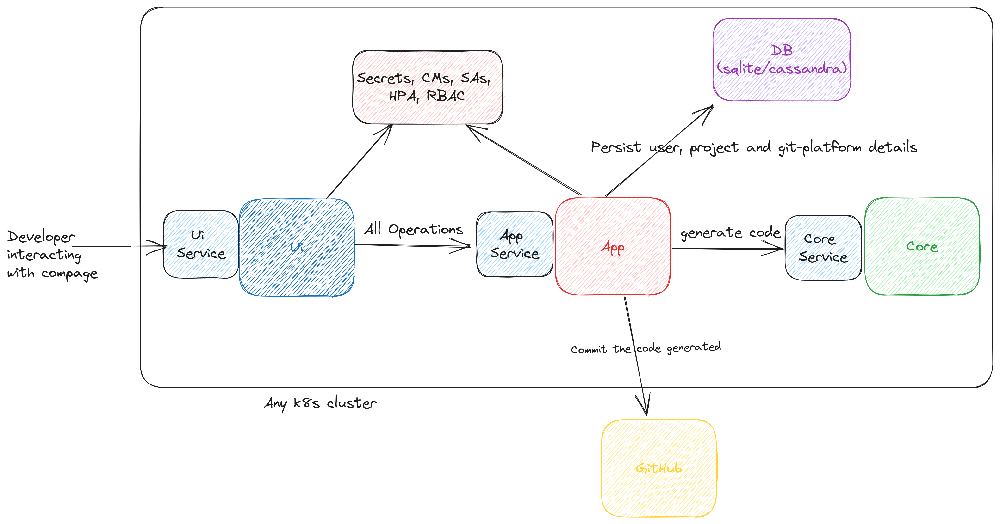

<b>Low-Code, No-Code for cloud-native</b>

<h4 align="center">
    <a href="https://discord.gg/DeapQc22qe">Discord</a> |
    <a href="https://github.com/intelops/compage/discussions">Discussions</a> |
    <a href="https://compage.dev?utm_source=github&utm_medium=social/">Site</a> |
    <a href="https://docs.compage.dev?utm_source=github&utm_medium=social/">Guide</a> |
    <a href="https://docs.compage.dev/docs/introduction">Docs</a> |
    <a href="https://docs.compage.dev/docs/introduction/contribute?utm_source=github&utm_medium=social">Contribute</a>  
</h4>

<h4 align="center">

 

</h4>

# Compage by IntelOps

Low-Code Framework to develop Rest APIs, gRPC, dRPC, GraphQL APIs, WebSockets, Micro-services, FaaS, Temporal workloads,
IoT and edge services, K8s controllers, K8s CRDs, K8s custom APIs, K8s Operators, K8s hooks, etc. with visual coding and
by automatically applying best practice methods like software supply chain security measures, SBOM, openAPI,
cloud-events, vulnerability reports, etc. Auto generate code after defining requirements in UI as architecture diagram.

**Draw the requirements for backend workloads, and then auto generate code, customize it and maintain it.**
> Our goal is to support both auto-generate code and import existing code. Let's see how far we can go with importing
> existing code support. One step at a time!

#### Problems that Compage is trying to solve:

Problems with many of the current low-code platforms -

- Single programming language support only.
- Vendor Lock-in Infrastructure if you want to choose their cloud hosting.
- No proper support or automation for self-hosting and also lots of dependencies on the low-code/no-code tool itself to
  run it on your infrastructure.
- No Zero-Vendor Lock-in platform to generate cloud-native. friendly backend source code, especially for Rest APIs,
  gRPC,
  WebSockets, etc. in any programming language and framework we want.
- Non-availability of a very opinionated development process & management of infrastructure.
- Not compatible to cloud-native, especially for self-hosting K8s environment.
- Not invoking standards like openAPI, Event-driven, software supply chain security, secure container builds,
  microservices, etc.
- Not supporting modern tech stack and no feasibility to adopt new tech stack dynamically.
- No bi-directional code management (export, import and manage).
- No easy UX to make any level of developer to learn, adopt and implement development process for K8s ecosystem for
  cloud-native world.
- and the list can go on **(please let us know what more you can think of, we will try to solve those problems for you)
  **

Solution: **Compage**

- An opensource tool that runs on your k8s cluster (can be deployed once per team), helps to visually develop backend
  workloads for cloud-native & K8s :-
- Easy to adopt & use UI/UX.
- GitHub's integration, container build tools, cosign, etc.
- Equipped with diagramming library to define the project requirements by drawing the flow of backend workloads.
- Annotations, labels, tags, versioning, etc. can be defined within the diagram using forms.
- Select the programming language and framework you prefer (support for each programming language and framework will be
  added one by one); first priority is GoLang and Rust. Frameworks can be configured as plug-ins.
- Auto generate code for backend workloads like Rest API, gRPC, dRPC, GraphQL, WebSockets, Microservices, FaaS,
  Temporal workloads, IoT and edge services, K8s controllers, K8s CRDs, K8s custom APIs, K8s Operators, K8s hooks, etc.
  **(for now support will be for golang and then Rust as priority, followed by Python, C, Carbon, Node.js, Dart, Deno,
  etc. Community contribution will help us to achieve more support)**
- Auto generate the backend code, based on requirements defined via diagram & forms
- Auto generate the endpoint configs to be able to use with API gateways & service-mesh environments like Kong, Tyk,
  Easegress, Istio, Linkerd, Kuma, Ngnix, Cilium tools, Calico, etc.
- Easy plug-ins by supporting tools like Ory Hydra, Kratos, Keto, OathKeeper, KeyCloak, Gluu, Janssen, Cerbos, Open
  Policy Agent, OAuth, OIDC, FIDO, SAML, Dex, MFA, Passwordless, etc.
- Auto build containers as multi-stage and/or distroless to make them secure, portable and optimal.
- Automatically take care of all git processes like tagging, versioning, commits, PRs, etc.
- Automatically enforce software supply chain security process like signing the source code for integrity and generating
  immutable ledger logs, generating SBOM, generating vulnerability report, and also generate configurations to auto
  verify, validate & control the source code integrity and container image integrity for deployments, etc. in K8s env.
- Automatically convert backend application related environment variables' content to configmaps, secrets, etc. to make
  the generated backend compatible to K8s of any flavor (K8s, K3s, TalOS, etc.) and also auto configs to support
  integration with Vault, cert-manager, external secrets, sealed secrets & Venafi tools for TLS/SSL and secrets
  management.
- Slowly add support for ML development & ML frameworks to make it easy to develop ML applications that will run on
  Kubernetes.
- **Automatically manage generated code for by auto creating the services catalog & their visualization by versioning
  and integrations, and also git repo observability**
- **please suggest what you would like to add as features**

-------------------------

#### Current features in compage

- An opensource tool that runs on your k8s cluster (mostly a local cluster running on developer's machine), helps to
  visually develop backend workloads for cloud-native & K8s.
- Easy to adopt & use UI.
- GitHub's integration for authentication, container build tools, cosign, etc.
- Equipped with diagramming library to define the project requirements by drawing the flow of backend workloads.
- Annotations, labels, tags, versioning, etc. can be defined within the diagram using forms.
- Auto generate code for backend workloads like Rest API.
- Auto generate the backend code, based on requirements defined via diagram & forms.
- Auto build containers as multi-stage and/or distro-less to make them secure, portable and optimal.
- Automatically take care of all git processes like tagging, versioning, commits, PRs, etc.
- Automatically enforce software supply chain security process like generating cosign configuration in GitHub actions
  for generated source code for the diagrams drawn, generating deepsource configurations, generating configurations for
  deployments, services etc. in K8s env.
- Can be deployed directly with docker images or via Helm chart. Helm chart is the tested and preferred way. Even if you
  are deploying compage with docker images, you still need K8s cluster access to persist project and user data in etcd
  as CRs.

#### Languages supported:

> OpenApi Generator based templates (REST)

- GoLang
- Java
- Python
- JavaScript
- Ruby
- **we would like to add more support to different languages. Please feel free to suggest.**

> Compage managed templates (REST)

- Go
- Rust (in progress)

Support of different programming languages, protocols and frameworks will be added one by one with community
contribution.

#### How to use Compage?

- A user logs in to the compage using his/her GitHub credentials. He/she will then need to provide permissions for the
  Compage GitHub App to create repositories on user's behalf, commit generated code to the repositories.
- User will be shown with a dialog box, where user has to select from existing projects or create a new project.
- A compage project has a one-to-one relationship with GitHub repository. The compage project's connected GitHub
  repository can contain all the generated source code for all the nodes created on drawing panel. Compage follows
  monorepo method, all connected microservices in single git repository.
- User then can use drawing panel to create nodes and configure them using forms. At last, user has to save the project
  and hit `Generate Code` button. The code will be generated and saved to GitHub repository.
- User can later use same panel to add more microservices(nodes) or modify existing microservices. When the code is
  generated, version is locked till that point and any change made post code-generation till next code-generation is
  locked next version. User's can have at most 10 versions per project. Moving between versions is not yet supported.

## Architecture

## Contributing

You are warmly welcome to contribute to Compage.
Please refer the detailed guide [CONTRIBUTING.md](./CONTRIBUTING.md).

## Community

Active communication channels

- Discord: [Discord](https://discord.gg/DeapQc22qe)

## Quick start

- Register an app - Refer [GitHub App setup](./github-app-setup.md).
- Follow step-by-step instructions given here [Run Compage on local](./deploy/README.md).

## License

Refer the licence - [LICENCE](./LICENSE).