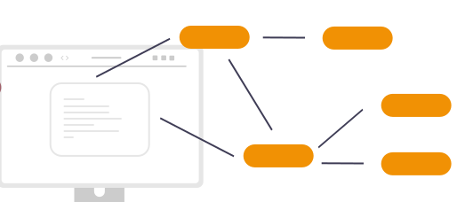

<b>Low-Code No-Code for Cloud Native</b>

# Compage.dev
Low-Code Framework to develop Microservices, REST APIs, GraphQL API, gRPC, dRPC, WebAssembly code, Temporal.io Workflows, Temporal.io Workers, etc. with visual coding and by automatically applying best practice methods like software supply chain security measures, SBOM, etc. Auto generate code after defining requirements in UI as architecture diagram. 

### Draw the requirements for backend, generate code, customize and maintain.
> Our goal is to support both auto-generate code and import existing code. Let's see how far we can go with importing existing code support. One step at a time! 

#### Supports:
- GoLang
- Rust
- Python
- Node.js
- Deno
- WebAssembly
- Temporal.io 
- Applications/Infra API Gateway
- Data API Gateway
- Runtime env in local with everything running in browser via WebAssembly & Containerized OS / Web-Containers (similar to the concepts/designs of browsix, openvscode-server, stackblitz.com, loft vcluster, etc.) 

> support of different programming languages and frameworks will be added one by one with community contribution.

------------
Problem:

problems with current low-code platforms - 
- single programming language support only
- locked-in infra if you want to choose their cloud hosting
- no proper support or automation for self-hosting and also lot of dependencies on the low-code/no-code tool itself to run it on your infra
- no zero-vendor lock-in platform to generate cloud-native friendly backend source code, especially for Rest APIs, gRPC, WebAssembly, etc. in any programming language and framework we want 
- very opinionated development process & management of infra 
- not compatible to cloud-native, especially for self-hosting K8s env
- not invoking standards like openAPI, Event-driven, software supply chain security, secure container builds, microservices, etc.
- not supporting modern tech stack and no feasibility to adopt new tech stack dynamically 
- no bi-directional code management (export, import and manage)
- no easy UX to make any level of developer to learn, adopt and implement development process for K8s ecosystem for cloud-native world
- and the list can go on **(please let us know what more you can think of, we will try to solve those problems for you)**

Solution:

Compage - opensource tool runs in your local or in WebAssembly based Web Containers within the browser :- 
- easy to adopt & use UI/UX 
- built-in vscode, git, container build tools, cosign, etc. 
- Diagramming library to define the project requirements by drawing the flow of backend workloads
- annotations, labels, tags, versioning, etc. can be defined within the diagram using forms
- select the programming language and framework you prefer (support for each programming language and framework will be added slowly); first priority is GoLang and Rust. Frameworks can be configured as plug-ins 
- auto generate code for backend workloads like Rest API, gRPC, dRPC, GraphQL, WebAssembly, microservices, FaaS, Temporal workloads, IoT and edge services, K8s controllers, K8s CRDs, K8s custom APIs, K8s Operators, K8s hooks, etc. **(for now support will be for golang and then Rust as priority, followed by Python, C, Carbon, Node.js, Dart, Deno, etc. Community contribution will help us to achieve more support)** 
- auto generate the backend code, based on requirements defined via diagram & forms 
- auto generate the endpoint configs to be able to use with API gateways & service-mesh environments like Kong, Tyk, Easegress, Istio, Linkerd, Kuma, Ngnix, Cilium tools, Calico, etc.
- easy plug-ins by supporting tools like Ory Hydra, Kratos, Keto, OathKeeper, KeyCloak, Gluu, Janssen, Cerbos, Open Policy Agent, OAuth, OIDC, FIDO, SAML, Dex, MFA, Passwordless, etc. 
- auto build containers as multi-stage and/or distroless to make them secure, portable and optimal
- automatically manage the service catalog & their visualization by versioning and integrations, and also git repo observability 
- automatically take care of all git processes like tagging, versioning, commits, PRs, etc.
- automatically enforce software supply chain security process like signing the source code for integrity and generating immutable ledger logs, generating SBOM, generating vulnerability report, and also generate configurations to auto verify, validate & control the source code integrity and container image integrity for deployments, etc. in K8s env 
- automatically convert backend application related environment variables' content to configmaps, secrets, etc. to make the generated backend compatible to K8s of any flavor (K8s, K3s, TalOS, etc.) and also auto configs to support integration with Vault, cert-manager, external secrets, sealed secrets & Venafi tools for TLS/SSL and secrets management 
- slowly add support for ML development & ML frameworks to make it easy to develop ML applications that will run on Kubernetes 
- **please suggest what you would like to add as features**

-------------------------
